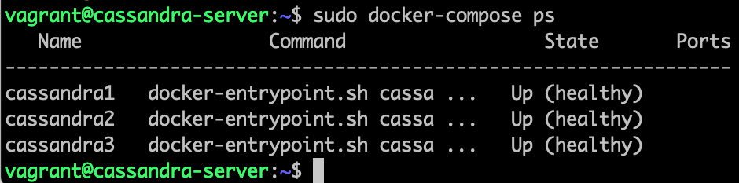
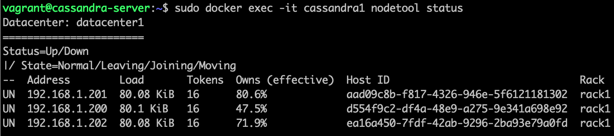
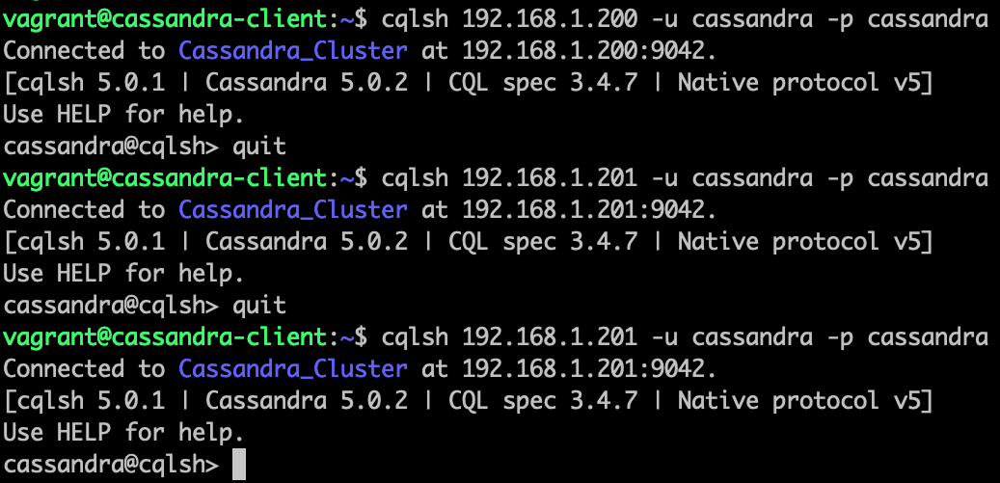

## Создание через Docker Compose тестового кластера Cassandra из трех инстансов

192.168.1.197 - адрес сервера с docker-compose

192.168.1.198 - адрес клиента с cqlsh

192.168.1.200-202 - адреса контейнеров с интансами cassandra

### Порядок запуска

Две виртуалки с ubuntu 22.04 lts создаются и запускаются через vagrant

`vagrant up`

Для запуска трех инстансов cassandra требуется не менее 3гб оперативной памяти. 

Используется "public_network", поэтому при запуске vagrant спросит, через какой сетевой интерфейс подключаться.
Это можно указать в опции "bridge:" (закомментировано).

После создания виртуалок, пропишется содержимое "~/.ssh/id_rsa.pub" для удобства подключения по ssh без пароля. Если этого файла нет, можно его создать через `ssh-keygen -t rsa`, либо подключаться по "vargant:vagrant"

На серверной машине установится из пакетов docker-compose и скопируется docker-compose.yml домашний каталог пользователя по умолчанию (vagrant).

На клиентской машине через snap установится cqlsh.

Далее, нужно зайти на серверную машину по ssh и выполнить команду

`sudo docker-compose up -d` - для запуска контейнеров в фоновом режиме

Процесс запуска можно контролировать через команду

`sudo docker-compose ps`

Состояние кластера можно наблюдать при помощи команды

`sudo docker exec -it cassandra1 nodetool status`

Когда кластер запущен, можно зайти на клиентскую машину и через cqlsh подключиться к cassandra

`cqlsh 192.168.1.200 -u cassandra -p cassandra`

`cqlsh 192.168.1.201 -u cassandra -p cassandra`

`cqlsh 192.168.1.202 -u cassandra -p cassandra`

После окончания тестов можно

`sudo docker-compose down` - остановить и удалить контейнеры

`vagrant halt` - остановить виртуальные машины

`vagrant destroy` - удалить вирутальные машины
